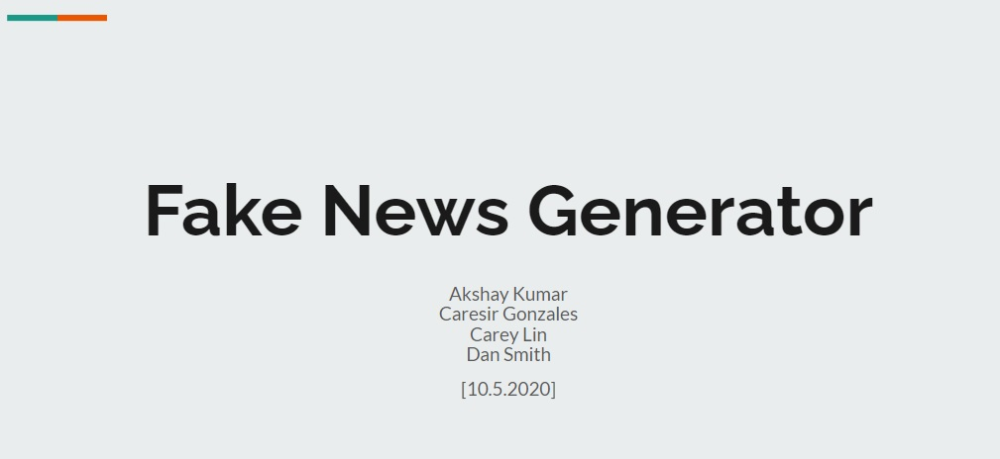
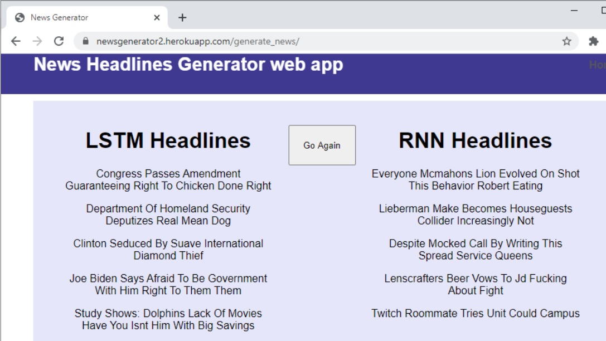

# FakeNewsGenerator

#### Project 2 - Fake News Generator
1. Data Acquisition (webscrape): [webscrape.ipynb](./webscrape.ipynb)
    * CSV saved data: [theonion_articles_raw.csv](./Resources/theonion_articles_raw.csv)
2. Models:
    * Word RNN model: [Akshay_Notebook.ipynb](./Akshay_Notebook.ipynb)
    * LSTM model: [LSTM.ipynb](/LSTM.ipynb)
3. Predictions Sample Website: [Newsgenerator2](https://newsgenerator2.herokuapp.com)
    * Predictions Website Content: [Site Content Root](./heroku_webapp/newsgenerator/)
4. Presentation Slides: [Google Slides](https://docs.google.com/presentation/d/1rA200A79eH7NgrOcl81yZ-Z5Uv7E9B5D7ieXPJSwxoA/edit?usp=sharing)

